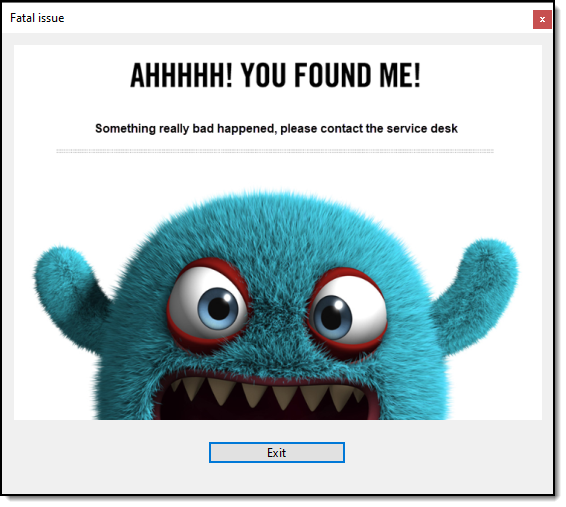

# About

Simple code sample for application-wide exception handler to write unhandled exceptions to a log file.

# Prerequisites

To run this project *as is* in this repository.

- VS2019
- .NET Core 5

# TechNet Wiki article

[Unhandled runtime exceptions window forms (C#)](https://social.technet.microsoft.com/wiki/contents/articles/54209.unhandled-runtime-exceptions-window-forms-c.aspx)

# Log viewer


# Closing window

Feel free to remove or change the image.



# Get source without all projects 

With Git installed, create a batch file with the following contents, save, run and add the cloned projects to your solution.
```batch
mkdir code
cd code
git init
git remote add -f origin https://github.com/karenpayneoregon/csharp-features
git sparse-checkout init --cone
git sparse-checkout add ExceptionHandling
git sparse-checkout add ThreadExceptionWindowsFormsApp
git pull origin master
:clean-up
del .gitattributes
del .gitignore
del .yml
del .editorconfig
del *.md
del *.sln
```

# Implement

```csharp
using System;
using System.Windows.Forms;
using ExceptionHandling;

namespace ThreadExceptionWindowsFormsApp
{
    /// <summary>
    /// Rig for unhandled exceptions.
    /// Note Text property set on error form is for demo purposes only
    /// </summary>
    static class Program
    {

        [STAThread]
        static void Main()
        {
            
            Application.SetHighDpiMode(HighDpiMode.SystemAware);
            Application.EnableVisualStyles();
            Application.SetCompatibleTextRenderingDefault(false);

            // Handling UI thread exceptions to the event.
            Application.ThreadException += UnhandledExceptions.Application_ThreadException;

            // For handling non-UI thread exceptions to the event. 
            AppDomain.CurrentDomain.UnhandledException += UnhandledExceptions.CurrentDomain_UnhandledException;

            // Indicates capturing exception has completed
            UnhandledExceptions.OnProcessingCompletedEvent += OnProcessingCompletedEvent;


            Application.Run(new Form1());

        }
        /// <summary>
        /// Display window informing application most close
        /// </summary>
        private static void OnProcessingCompletedEvent()
        {
            var f = new AppErrorForm { Text = @"Your title goes here" };
            f.ShowDialog();
            Application.Exit();
        }
    }
}
```